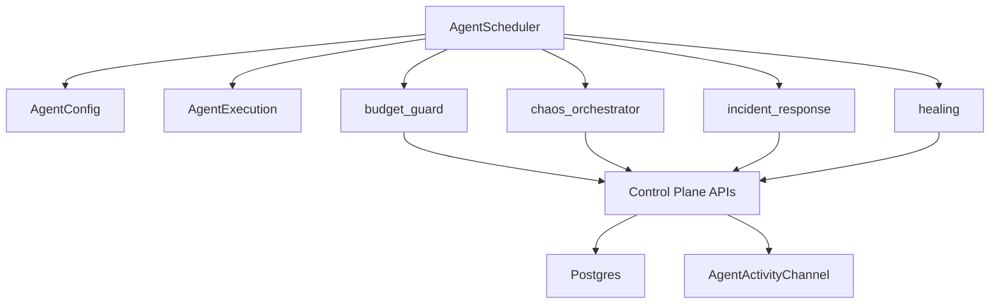
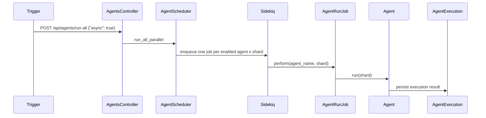

# CellGuard Autonomous Agents

This document defines the runtime autonomous-agent layer used by CellGuard.

## Scope
CellGuard runs four canonical agents:
- `budget_guard`
- `chaos_orchestrator`
- `incident_response`
- `healing`

These names are the API and persistence contract (`agent_executions.agent_name`, `/api/agents/:name/*`).

## Architecture



## Execution model

Hybrid runtime:
- Development mode: in-process/manual runs for fast feedback
- Production and CI-ready mode: Sidekiq + Redis with scheduler-driven fanout



Scheduler source:
- `config/sidekiq.yml` (`agent_scheduler` every 60s)
- `AgentSchedulerJob` enqueues periodic work

## Safety model
Chaos-impacting behavior must remain guarded:
- Allowed only in development or with `ALLOW_DEMO_ENDPOINTS=true`
- Agents must enforce business-hour and incident-aware checks for chaos actions
- Retry limits and bounded blast radius required
- Errors must be structured (`chaos_failed`) and auditable

## Configuration contract
Core:
- `CELLGUARD_AGENTS_ENABLED`
- `CELLGUARD_AGENT_EXECUTION_INTERVAL_SECONDS`
- `ALLOW_DEMO_ENDPOINTS`
- `CLASSIFIER_STUB`
- `CELLGUARD_TOKEN`

Per-agent toggles (env defaults + DB override via `agent_configs`):
- `CELLGUARD_BUDGET_GUARD_ENABLED`
- `CELLGUARD_CHAOS_ORCHESTRATOR_ENABLED`
- `CELLGUARD_INCIDENT_RESPONSE_ENABLED`
- `CELLGUARD_HEALING_AGENT_ENABLED`

Precedence:
1. Persisted `agent_configs` override
2. Environment default

## API contract
Status and activity:
- `GET /api/agents/status`
- `GET /api/agents/activity?limit=20`

Control:
- `POST /api/agents/run-all`
- `POST /api/agents/:name/run`
- `POST /api/agents/:name/toggle`

`POST /api/agents/run-all` behavior:
- default returns async fanout (`mode: "async"`) unless `async=false`
- sync mode still supported for controlled execution paths

## WebSocket contract
Channel:
- `AgentActivityChannel`

Expected event families:
- `initial_state`
- `agent_triggered`
- `agent_error`
- `status_update`
- activity stream events with agent/shard/status/action/timestamps

## Data contract
Tables:
- `agent_executions`: runtime history and outcomes
- `agent_configs`: mutable runtime overrides

Agent execution record should include:
- `agent_name`
- shard reference
- status (`completed`, `failed`, etc.)
- action/description/context
- timing metadata (`duration_ms`, timestamps)

## Operational run patterns
Manual single-agent run:

```bash
curl -X POST http://localhost:3000/api/agents/budget_guard/run \
  -H "Content-Type: application/json" \
  -d '{"shard":"shard-default"}'
```

Async fanout run:

```bash
curl -X POST http://localhost:3000/api/agents/run-all \
  -H "Content-Type: application/json" \
  -d '{"async":true}'
```

Toggle agent:

```bash
curl -X POST http://localhost:3000/api/agents/chaos_orchestrator/toggle \
  -H "Content-Type: application/json" \
  -d '{"enabled":false}'
```

## Consolidated implementation priorities
The earlier strategy notes are consolidated into this order:
1. Keep gate-proof deterministic in CI
2. Keep Sidekiq scheduler and async fanout reliable
3. Add metrics and deployment proof next
4. Add advanced AI-copilot layers only after core safety/reproducibility stays green
