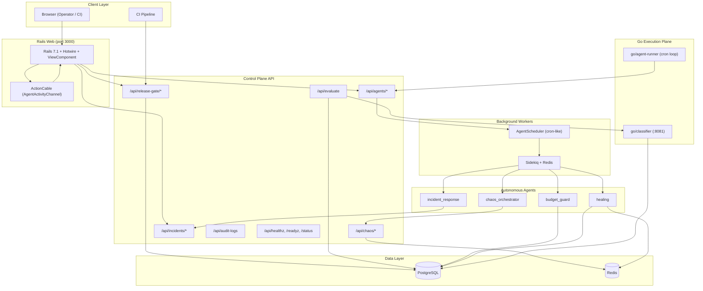

# CellGuard

Reliability control plane that enforces release policy from live operational signals. Prevents bad deploys by evaluating release gates against error budgets, orchestrating chaos drills, and running autonomous agents for budget protection, incident response, and healing.

## Architecture


```mermaid
flowchart TB
    subgraph "Client Layer"
        UI["Browser (Operator / CI)"]
        CI["CI Pipeline"]
    end

    subgraph "Rails Web (port 3000)"
        WEB["Rails 7.1 + Hotwire + ViewComponent"]
        AC["ActionCable (AgentActivityChannel)"]
    end

    subgraph "Control Plane API"
        GATE["/api/release-gate/*"]
        EVAL["/api/evaluate"]
        CHAOS["/api/chaos/*"]
        AGENTS["/api/agents/*"]
        INC["/api/incidents/*"]
        AUDIT["/api/audit-logs"]
        HEALTH["/api/healthz, /readyz, /status"]
    end

    subgraph "Background Workers"
        SK["Sidekiq + Redis"]
        SCHED["AgentScheduler (cron-like)"]
    end

    subgraph "Autonomous Agents"
        BG["budget_guard"]
        CO["chaos_orchestrator"]
        IR["incident_response"]
        HE["healing"]
    end

    subgraph "Go Execution Plane"
        CLASS["go/classifier (:8081)"]
        RUNNER["go/agent-runner (cron loop)"]
    end

    subgraph "Data Layer"
        PG[("PostgreSQL")]
        RD[("Redis")]
    end

    UI --> WEB
    CI --> GATE
    WEB --> GATE
    WEB --> AGENTS
    WEB --> INC
    WEB --> AC
    GATE --> PG
    EVAL --> PG
    EVAL --> CLASS
    CHAOS --> RD
    AGENTS --> SCHED
    SCHED --> SK
    SK --> BG
    SK --> CO
    SK --> IR
    SK --> HE
    BG --> PG
    CO --> CHAOS
    IR --> INC
    HE --> PG
    HE --> RD
    CLASS --> PG
    RUNNER --> AGENTS
    AC --> WEB
```

## Core invariants

1. **Gate is the source of truth.** `POST /api/release-gate/check` is the only path CI calls. It must be deterministic given the same inputs.
2. **Chaos is opt-in.** Chaos endpoints and the `chaos_orchestrator` agent require `ALLOW_DEMO_ENDPOINTS=true` or development mode. Never auto-enable in production.
3. **All mutations are audited.** `release-gate/override`, `chaos/*`, `agents/:name/toggle`, `agents/:name/run`, `incidents/*` mutations, and `evaluate` all write to `audit_logs` with actor, method, path, IP, and timestamp.
4. **Token-guarded mutations.** Outside of development/demo, privileged endpoints require `X-CELLGUARD-TOKEN`. `GET` endpoints (`healthz`, `readyz`, `status`, `release-gate/check`, `agents/status`, `agents/activity`) are public.
5. **No raw exception leakage.** All API errors return structured JSON (`{ error, message }`). Production never echoes exception messages.

## Runtime contract

The four canonical agents are the API and persistence contract (`agent_executions.agent_name`, `/api/agents/:name/*`, `AgentScheduler`):

- `budget_guard` — monitors error budget burn rate, predicts exhaustion
- `chaos_orchestrator` — schedules controlled failure drills when safety checks pass
- `incident_response` — auto-suggests runbooks for new incidents
- `healing` — attempts low-risk recovery actions with auditability

## Safety model

- Chaos-impacting behavior is guarded:
  - Allowed only in development or with `ALLOW_DEMO_ENDPOINTS=true`
  - Agents enforce business-hour and incident-aware checks for chaos actions
  - Retry limits and bounded blast radius required
  - Errors are structured (`chaos_failed`) and auditable

## Configuration contract

### Core (env)

| Variable | Purpose |
|----------|---------|
| `CELLGUARD_TOKEN` | Admin token for privileged API mutations (required in production) |
| `ALLOW_DEMO_ENDPOINTS` | Enable chaos + failure injection (dev/demo only) |
| `CLASSIFIER_STUB` | Use in-process Ruby classifier (no Go service required) |
| `CLASSIFIER_URL` | URL of the Go classifier (default `http://localhost:8081`) |
| `CELLGUARD_AGENTS_ENABLED` | Master switch for the autonomous agent layer |
| `CELLGUARD_AGENT_EXECUTION_INTERVAL_SECONDS` | Scheduler tick interval (default 60) |
| `DATABASE_URL` | Postgres connection string |
| `REDIS_URL` | Redis connection string (Sidekiq + ActionCable) |
| `SECRET_KEY_BASE` | Rails secret key |
| `GIT_SHA` | Deployed commit SHA (logged in audit trail) |

### Per-agent toggles (env default, DB override via `agent_configs`)

| Variable | Default | Purpose |
|----------|---------|---------|
| `CELLGUARD_BUDGET_GUARD_ENABLED` | `true` | Enable `budget_guard` |
| `CELLGUARD_CHAOS_ORCHESTRATOR_ENABLED` | `false` | Enable `chaos_orchestrator` (safety) |
| `CELLGUARD_INCIDENT_RESPONSE_ENABLED` | `true` | Enable `incident_response` |
| `CELLGUARD_HEALING_AGENT_ENABLED` | `true` | Enable `healing` |

Precedence: persisted `agent_configs` row → environment variable → DEFAULTS.

## API contract

### Public (no token required)

| Endpoint | Purpose |
|----------|---------|
| `GET /api/healthz` | Liveness probe |
| `GET /api/readyz` | Readiness probe (DB + Redis + Sidekiq + classifier) |
| `GET /api/status` | Detailed status with version and component state |
| `GET /api/release-gate/check` | CI gate check (200 open / 423 locked) |
| `GET /api/agents/status` | Agent enablement and recent execution counts |
| `GET /api/agents/activity?limit=20` | Recent agent execution feed |

### Privileged (require `X-CELLGUARD-TOKEN` in production)

| Endpoint | Purpose |
|----------|---------|
| `POST /api/release-gate/override` | Audited manual override |
| `POST /api/evaluate` | Trigger budget evaluation + classification |
| `POST /api/ingest/job-stat` | Ingest operational metrics |
| `POST /api/inject-failures` | Demo: simulate failures (demo mode only) |
| `POST /api/chaos/partition` | Inject network partition (demo mode only) |
| `POST /api/chaos/heal` | Recover from chaos (demo mode only) |
| `GET /api/audit-logs` | Read audit trail |
| `POST /api/incidents/:id/acknowledge` | Acknowledge incident |
| `POST /api/incidents/:id/resolve` | Resolve incident |
| `POST /api/incidents/:id/escalate` | Escalate incident |
| `POST /api/incidents/:id/note` | Add note to incident |
| `POST /api/agents/run-all` | Run all enabled agents (async by default) |
| `POST /api/agents/:name/run` | Run a specific agent |
| `POST /api/agents/:name/toggle` | Enable/disable an agent |

## WebSocket contract

Channel: `AgentActivityChannel`

Event families:
- `initial_state` — sent on subscribe
- `agent_triggered` — an agent run started
- `agent_error` — an agent run failed
- `status_update` — agent status or activity feed changed
- Activity stream events with `agent`, `shard`, `status`, `action`, `created_at`

## Data contract

### Tables

- `agent_executions` — runtime history and outcomes per agent
- `agent_configs` — mutable runtime overrides for agent toggles
- `audit_logs` — immutable audit trail of privileged operations
- `incidents` — classifier-driven incident records
- `error_budgets` — per-shard SLO budget state
- `job_stats` — ingested operational metrics
- `shards` — logical deploy units

### Agent execution record fields

`agent_name`, `shard_id`, `incident_id`, `status` (running / completed / failed), `action_taken`, `action_details`, `result`, `error_message`, `started_at`, `completed_at`, `created_at`, `updated_at`. Helper `duration_ms` returns elapsed milliseconds.

## Commands

### Local development

```bash
# Start the full local stack (Rails + Sidekiq + scheduler)
ALLOW_DEMO_ENDPOINTS=true CLASSIFIER_STUB=true bin/run-all

# Or three-terminal mode
bin/dev                                    # Rails web
bundle exec sidekiq -C config/sidekiq.yml  # Sidekiq worker
make go-classifier-run                     # Go classifier on :8081
make go-agent-runner-run                   # Go agent runner
```

### Testing

```bash
bundle exec rails test          # Rails test suite
make go-classifier-test         # Go classifier tests
make go-agent-runner-test       # Go agent-runner tests
```

### Game day (deterministic gate proof)

```bash
make gameday
# 1. Gate starts open (200)
# 2. Partition Redis (20s)
# 3. Inject failures (deterministic signal)
# 4. Evaluate + classify
# 5. Gate locks (423)
# 6. Heal
```

### UI evidence

```bash
make go-ui-smoke
# Renders the dashboard and saves tmp/ui-dashboard.png
```

### Reset demo state

```bash
make reset-demo
make enable-chaos-orchestrator   # optional
```

### Manual agent run

```bash
# Single agent
curl -X POST http://localhost:3000/api/agents/budget_guard/run \
  -H "Content-Type: application/json" \
  -H "X-CELLGUARD-TOKEN: $CELLGUARD_TOKEN" \
  -d '{"shard":"shard-default"}'

# Async fanout
curl -X POST http://localhost:3000/api/agents/run-all \
  -H "Content-Type: application/json" \
  -H "X-CELLGUARD-TOKEN: $CELLGUARD_TOKEN" \
  -d '{"async":true}'

# Toggle
curl -X POST http://localhost:3000/api/agents/chaos_orchestrator/toggle \
  -H "Content-Type: application/json" \
  -H "X-CELLGUARD-TOKEN: $CELLGUARD_TOKEN" \
  -d '{"enabled":false}'
```

## Files to know

| Path | Why |
|------|-----|
| `app/services/agent_scheduler.rb` | Fanout controller for all agents |
| `app/agents/*_agent.rb` | The four canonical agents |
| `app/services/budget_evaluator.rb` | Core gate logic |
| `app/services/chaos_service.rb` | Fault injection primitives |
| `app/services/classifier_client.rb` | Ruby client for the Go classifier |
| `app/controllers/api/*_controller.rb` | API surface (all under `Api::TokenGuard` for mutations) |
| `app/controllers/concerns/api.rb` | `TokenGuard`, `StructuredErrors`, `RequestAudit` |
| `app/services/sre_scorecard_service.rb` | SRE metrics for the dashboard |
| `app/jobs/agent_run_job.rb` | Sidekiq job that runs one agent on one shard |
| `app/channels/agent_activity_channel.rb` | WebSocket activity feed |
| `db/schema.rb` | Source of truth for the data model |
| `app/services/xyops/*` | The adapter layer: client, remediation_runner (safety), event_ingestor, simulator |
| `app/models/xyops_*.rb` + migration 20250425... | Execution fabric state for audit/incident context |
| `config/sidekiq.yml` | Sidekiq + scheduler config |
| `go/classifier/` | Go classifier service |
| `go/agent-runner/` | Go agent runner (calls Rails HTTP APIs) |

## Files to avoid

- `tmp/` — runtime artifacts, never edit
- `log/` — runtime logs, never edit
- `storage/` — Active Storage (unused by default)
- `vendor/bundle/` — bundled gems
- `node_modules/` — JS deps
- `screenshots/` — generated evidence

## Design & Frontend Conventions (flagship mission control / exec demo / incident command)

The visible product experience must credibly read as **mission control** (dashboard cockpit), **executive demo** (landing first viewport), and **incident command** (incidents triage) in one coherent premium B2B reliability control plane.

**Core rules (locked by 2026 flagship pass):**
- First viewport on `/` must surface live OS signals above fold: gate state (200/423), SLO/burn/budget, xyOps fabric peek, active agents count, recent audit. Not a generic SaaS hero.
- `/dashboard` uses **command composition grid** (not pure vertical stack of panels) for first viewport: release gate (large), xyOps/ops fabric, active agents, audit trail visible together + command bar. Lower content (demo flow, full agents, scorecards, chaos, recent lists) preserved for complete operator journey.
- Open vs locked states are **visually distinct and screenshot-worthy**: green calm/permissioned (tints, glows, 200 dominant) vs red urgent (pulses, danger accents, full "CAUSE OF LOCK" xyOps evidence block emphasized).
- `/incidents` gives featured incident + xyOps evidence + runbook/action/SLA/timeline **clear visual hierarchy** in sidebar; mobile collapses to usable triage stack (list then sections), not long dark boxes.
- **Tokens (source of truth in `application.css` :root)**: --cg-bg #050814, --cg-surface rgba(12,20,40,0.82), --cg-border rgba(100,116,139,0.18), --cg-text #e2e8f0, --cg-ok #22c55e, --cg-danger #ef4444, --cg-info #38bdf8, --cg-accent #22c55e, --cg-accent-cool #38bdf8, --cg-line rgba(148,163,184,0.18). Typography: Geist body, JetBrains Mono for all metrics/codes/evidence. Radii 0.45-0.95rem, dense padding 0.5-1.35rem, subtle blur + linear evidence grids. Never generic dark cards.
- **No new frameworks.** Rails + Hotwire + ViewComponent + Stimulus + custom .cg-* CSS only. Prefer edits to page views + component templates + CSS + tiny presentation Stimulus.
- **Data:** sourced from existing controller instance variables (minimal ivar adds for presentation data only; no behavior/logic changes). Never-empty via DemoDataService.
- **Preserve exactly:** all actions (run eval/gameday/heal/override/agent toggle/run, incident ack/resolve/escalate/note, demo steps, chaos buttons), WS feeds, modals, audit on mutations, token guards (bypass in demo), gate 200/423 semantics.
- **Icons:** expand `heroicons_helper.rb` (inline SVG) when new evidence panels need them; no gem.
- **Motion:** existing CSS + data-gsap (shell); respect reduced-motion. No new libs.
- **Screenshots (generated evidence, replace only after verification):** `npm run screenshots` (landing/dashboard/incidents/docs, desktop+mobile), `npm run screenshot:open`, `npm run screenshot:locked` (self-seed + capture), `make go-ui-smoke` (tmp/ui-dashboard.png). BASE_URL=http://127.0.0.1:3000 when needed. Always run against seeded state (gameday/reset for locked/open).
- **Visual inspection (mandatory before docs update):** use `view_image` on `screenshots/*.png` and `tmp/ui-*.png`. Verify: first viewport signals/composition present, open vs locked distinct, no overlap/cut text/unreadable controls/empty flagship panels, mobile usable (no h-scroll, touch targets), matches accepted design targets (session images from planning or equivalent), high evidence density but scannable.
- Update `README.md` (screenshots section text only) and this `AGENTS.md` **only after** new screenshots pass inspection + tests/gameday.

**Files for frontend work:**
- `app/assets/stylesheets/application.css` (tokens + .cg-exec-* / .cg-mission-* / .cg-incident-* / open/locked states)
- `app/views/marketing/home.html.erb`, `app/views/dashboard/index.html.erb`, `app/views/incidents/index.html.erb`
- `app/components/ui/*_component.html.erb` (small state/evidence tweaks)
- `app/helpers/heroicons_helper.rb`
- Controllers only for presentation ivars (rescued).

**Verification steps for any frontend change:**
1. `bundle exec rails test && make go-classifier-test && make go-agent-runner-test`
2. `ALLOW_DEMO_ENDPOINTS=true CLASSIFIER_STUB=true bin/run-all` (or partial)
3. `make gameday` (or closest; note blockers)
4. `make go-ui-smoke`
5. `npm run screenshot:open && npm run screenshot:locked && npm run screenshots`
6. `view_image` on new screenshots + visual checklist above.
7. Update README + AGENTS.md design section only on pass.

## Done-when checklist

A change is "done" when all of these are true:

1. `bundle exec rails test` passes (0 failures, 0 errors)
2. `make go-classifier-test` passes
3. `make go-agent-runner-test` passes
4. `make gameday` transitions the gate from `200` to `423 Locked` and back
5. `make go-ui-smoke` renders the dashboard without errors
6. New screenshots (npm scripts + go-ui-smoke) pass visual inspection via `view_image` (first viewport signals/composition, open vs locked distinct, no layout bugs, match design targets, mobile usable)
7. `AGENTS.md` "Design & Frontend Conventions" + README screenshots section updated (post-inspection)
8. No raw exception messages leak from API endpoints (production mode)
9. Any new mutation endpoint is covered by `Api::TokenGuard`
10. Any new mutation endpoint writes to `audit_logs` via `Api::RequestAudit`
11. No new gem added without justification in the PR description
12. No new env var added without documenting it in `README.md` and `docs/DEPLOYMENT.md`
13. No new endpoint added without updating the API contract table above
14. No schema change without a migration

## Consolidated implementation priorities

1. Keep gate-proof deterministic in CI
2. Keep Sidekiq scheduler and async fanout reliable
3. Keep the production safety model intact (token guards, audit trail, chaos opt-in)
4. Keep the operator journey complete and never-empty
5. Add metrics and deployment proof
6. Add advanced AI-copilot layers only after core safety/reproducibility stays green
