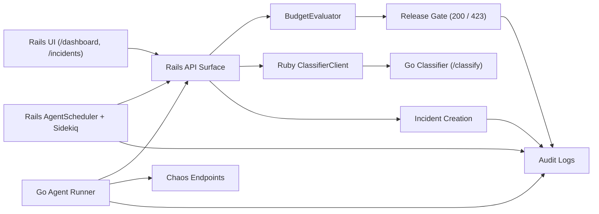

# CellGuard Architecture

```mermaid
flowchart LR
  UI["Rails UI (/dashboard, /incidents)"] --> API["Rails API Surface"]
  API --> BE["BudgetEvaluator"]
  API --> RCC["Ruby ClassifierClient"]
  RCC --> GCLS["Go Classifier (/classify)"]
  BE --> GATE["Release Gate (200 / 423)"]
  API --> INC["Incident Creation"]
  GATE --> AUD["Audit Logs"]
  INC --> AUD

  RSCH["Rails AgentScheduler + Sidekiq"] --> API
  GRUN["Go Agent Runner"] --> API
  GRUN --> CHAOS["Chaos Endpoints"]
  RSCH --> AUD
  GRUN --> AUD
```
