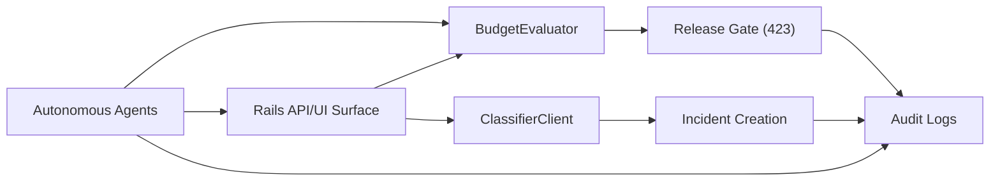

# CellGuard Architecture

```mermaid
flowchart LR
  A["Rails API/UI Surface"] --> B["BudgetEvaluator"]
  A --> C["ClassifierClient"]
  B --> D["Release Gate (423)"]
  C --> E["Incident Creation"]
  D --> F["Audit Logs"]
  E --> F
  G["Autonomous Agents"] --> B
  G --> A
  G --> F
```
