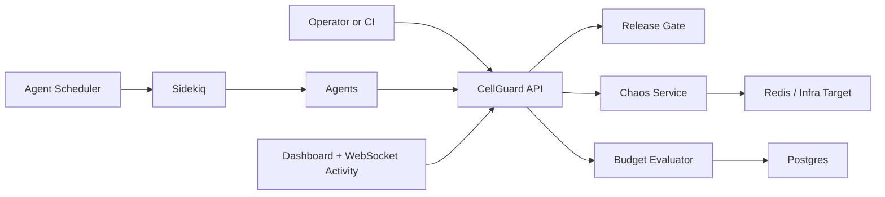
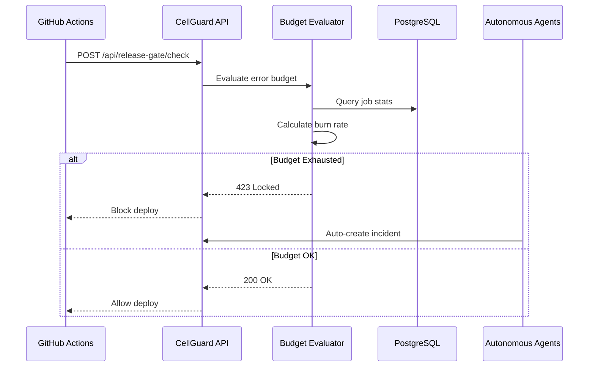
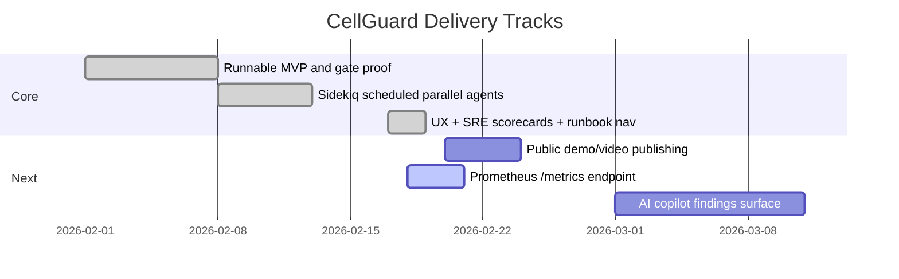

# CellGuard

> **Watch it work** (30 seconds): See the release gate flip from open → locked after chaos injection

[](https://github.com/AngelP17/Cellguard/actions/workflows/gate-proof.yml)

CellGuard is a reliability control plane that enforces release policy from live operational signals.

## What it does

- **Policy-as-code release gate** (`200` open, `423 Locked` blocked)
- **Chaos workflows** for controlled failure injection and recovery
- **Audited override** path for governance
- **Autonomous agents** for budget protection, chaos orchestration, incident response, and healing



---

## 🚀 Run The Local Demo (30 Seconds)

CellGuard is currently documented as local-first (no public hosted demo link).
Use the local stack:

```bash
ALLOW_DEMO_ENDPOINTS=true CLASSIFIER_STUB=true bin/run-all
```

### Quick Demo Flow (30 seconds)

```bash
# 1. Check gate status (starts open)
curl http://localhost:3000/api/release-gate/check?shard=shard-default

# 2. Inject failures (simulates degraded service)
curl -X POST http://localhost:3000/api/inject-failures \
  -H "Content-Type: application/json" \
  -d '{"shard":"shard-default","error_rate":0.15,"total":1000}'

# 3. Evaluate budget (processes the failure signal)
curl -X POST http://localhost:3000/api/evaluate \
  -H "Content-Type: application/json" \
  -d '{"shard":"shard-default","window_minutes":60}'

# 4. Gate is now LOCKED (HTTP 423)
curl -v http://localhost:3000/api/release-gate/check?shard=shard-default
# → HTTP/1.1 423 Locked

# 5. View the dashboard
open http://localhost:3000/dashboard
```

**What you'll see**:
- Green gate → Red locked gate in real-time
- Incident auto-created in the dashboard
- Audit trail showing the evaluation

---

## 👀 UI Entry Points

When running locally:
- `http://localhost:3000/`
- `http://localhost:3000/dashboard`
- `http://localhost:3000/incidents`

Automated UI capture (Go Rod + stealth):

```bash
make go-ui-smoke
```

This writes a screenshot to `tmp/ui-dashboard.png`.

---

## 🏗️ Architecture Highlights



---

## 💻 Local Development (For Contributors)

### Prerequisites
- Ruby `3.3.0`
- Bundler `2.5.x`
- PostgreSQL `16`
- Redis (local or container)

### One-Command Start

```bash
ALLOW_DEMO_ENDPOINTS=true CLASSIFIER_STUB=true bin/run-all
```

This starts:
- Rails web server
- Sidekiq worker with scheduler
- Optional async agent fanout
- Live execution monitoring

### Manual 3-Terminal Mode

Terminal 1 (Web):
```bash
export PATH="/opt/homebrew/opt/postgresql@16/bin:$PATH"
eval "$(rbenv init - zsh)"
bin/dev
```

Terminal 2 (Workers):
```bash
export PATH="/opt/homebrew/opt/postgresql@16/bin:$PATH"
eval "$(rbenv init - zsh)"
bundle exec sidekiq -C config/sidekiq.yml
```

Terminal 3 (Trigger agents):
```bash
curl -X POST http://localhost:3000/api/agents/run-all \
  -H "Content-Type: application/json" \
  -d '{"async":true}'
```

### Go Execution Plane (Classifier + Agent Runner)

This repo now includes two Go services:
- `go/classifier` (`/classify`, `/healthz`, `/metrics`)
- `go/agent-runner` (periodic agent loop calling Rails HTTP APIs)

Run locally:

```bash
# Terminal 4: Classifier service on :8081
make go-classifier-run

# Terminal 5: Agent runner (safe defaults; chaos disabled unless enabled explicitly)
make go-agent-runner-run
```

Enable autonomous chaos from runner (optional):

```bash
cd go/agent-runner
RAILS_BASE_URL=http://localhost:3000 SHARD=shard-default AGENT_RUNNER_ENABLE_CHAOS=true go run ./cmd/runner
```

### If dashboard shows `LOCKED (423)` and you want a fresh local state

```bash
make reset-demo
make enable-chaos-orchestrator   # optional
```

---

## 🔌 Core APIs

| Endpoint | Purpose |
|----------|---------|
| `GET /api/release-gate/check` | Check if deploy is allowed |
| `POST /api/release-gate/override` | Audited manual override |
| `POST /api/ingest/job-stat` | Ingest operational metrics |
| `POST /api/evaluate` | Trigger budget evaluation |
| `POST /api/inject-failures` | Demo: simulate failures |
| `POST /api/chaos/partition` | Demo: network partition |
| `GET /api/agents/status` | View autonomous agent status |

---

## 🎮 Game Day Proof

```bash
make gameday
```

This deterministic script proves the policy enforcement:
1. Gate starts open (`200`)
2. Fault + evaluation pipeline runs
3. Gate locks (`423`)
4. Heal and re-check succeeds

---

## 🚢 Deployment

Public hosting docs are intentionally deferred until a production-ready demo/video is published.
Current source of truth is local execution + CI gate proof.

---

## 📊 Roadmap



---

## 📚 Documentation

- [Agent Runtime Design](./docs/AGENTS.md)
- [Game Day Runbook](./docs/runbooks/gameday.md)
- [Architecture Overview](./ARCHITECTURE.md)

---

## 🔐 Security & Governance

- All gate overrides are audited
- Chaos endpoints require `ALLOW_DEMO_ENDPOINTS=true`
- Autonomous agents have safety guards (business hours, budget checks)
- See [SECURITY.md](./SECURITY.md)

---

## 🎯 For Recruiters

**The 30-second pitch**:

> CellGuard is a reliability control plane that prevents bad deploys by monitoring error budgets in real-time. It features autonomous agents that predict issues before they happen, chaos engineering for resilience validation, and a 423 Locked gate that CI systems can query.
>
> **Run it locally**: `ALLOW_DEMO_ENDPOINTS=true CLASSIFIER_STUB=true bin/run-all`

**Key technical decisions**:
- Rails 7.1 + Hotwire for rapid UI development
- Sidekiq + Redis for reliable job processing
- Policy-as-code (423 status) for CI integration
- Autonomous agent layer for proactive reliability

---

Built with ☕ and 🛡️ for teams that care about reliability.
