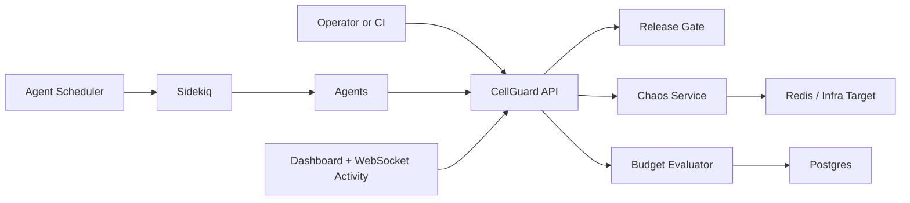
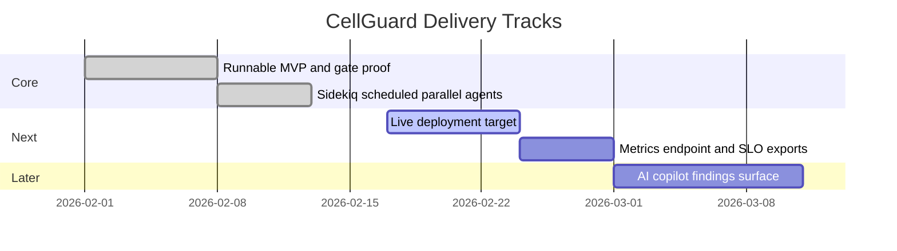

# CellGuard

CellGuard is a reliability control plane that enforces release policy from live operational signals.

## What it does
- Policy-as-code release gate (`200` open, `423 Locked` blocked)
- Chaos workflows for controlled failure injection and recovery
- Audited override path for governance
- Autonomous agents for budget protection, chaos orchestration, incident response, and healing



## Runtime modes
- Development fast feedback: in-process/manual trigger paths
- Production and CI-ready: Sidekiq + Redis scheduled fanout (`config/sidekiq.yml`)

## Prerequisites
- Ruby `3.3.0`
- Bundler `2.5.x`
- PostgreSQL `16`
- Redis (local or container)

## Quick start

```bash
export PATH="/opt/homebrew/opt/postgresql@16/bin:$PATH"
eval "$(rbenv init - zsh)"
bundle install
bin/rails db:prepare
```

## Run everything with one command

```bash
ALLOW_DEMO_ENDPOINTS=true CLASSIFIER_STUB=true bin/run-all
```

`bin/run-all` starts:
- Rails web server
- Sidekiq worker with scheduler
- Optional async `POST /api/agents/run-all` trigger
- Optional AgentExecution monitor loop

Useful flags:

```bash
bin/run-all --no-trigger
bin/run-all --no-monitor
bin/run-all --interval 2
bin/run-all --host http://localhost:3000
```

## Manual 3-terminal mode

Terminal 1:
```bash
export PATH="/opt/homebrew/opt/postgresql@16/bin:$PATH"
eval "$(rbenv init - zsh)"
bin/dev
```

Terminal 2:
```bash
export PATH="/opt/homebrew/opt/postgresql@16/bin:$PATH"
eval "$(rbenv init - zsh)"
bundle exec sidekiq -C config/sidekiq.yml
```

Terminal 3:
```bash
curl -X POST http://localhost:3000/api/agents/run-all \
  -H "Content-Type: application/json" \
  -d '{"async":true}'
```

## Core APIs
- `GET /api/release-gate/check`
- `POST /api/release-gate/override`
- `POST /api/ingest/job-stat`
- `POST /api/evaluate`
- `POST /api/inject-failures`
- `POST /api/chaos/partition`
- `POST /api/chaos/heal`
- `GET /api/audit-logs`
- `GET /api/agents/status`
- `GET /api/agents/activity`
- `POST /api/agents/run-all`
- `POST /api/agents/:name/run`
- `POST /api/agents/:name/toggle`

## Deterministic game day proof

```bash
make gameday
```

Expected policy result:
1. Gate starts open (`200`)
2. Fault + evaluation pipeline runs
3. Gate locks (`423`)
4. Heal and re-check path succeeds

## CI gate proof
- `.github/workflows/gate-proof.yml`
- `.github/workflows/deploy-gated.yml`

`deploy-gated.yml` is intended to run only after gate-proof success.

## Consolidated roadmap
The planning content from previous strategy docs is now captured here as prioritized tracks:



## Project docs
- Agent runtime design: `/Users/apinzon/Desktop/Active Projects/Cellguard/docs/AGENTS.md`
- Game day runbook: `/Users/apinzon/Desktop/Active Projects/Cellguard/docs/runbooks/gameday.md`
