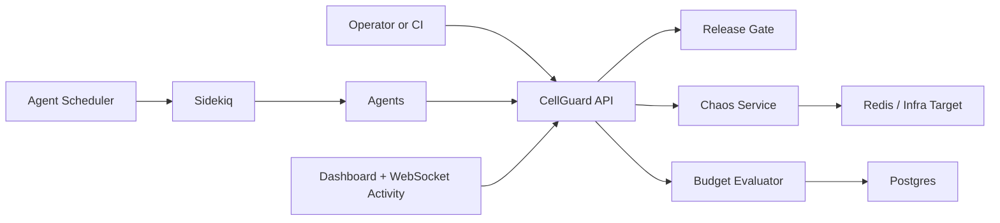
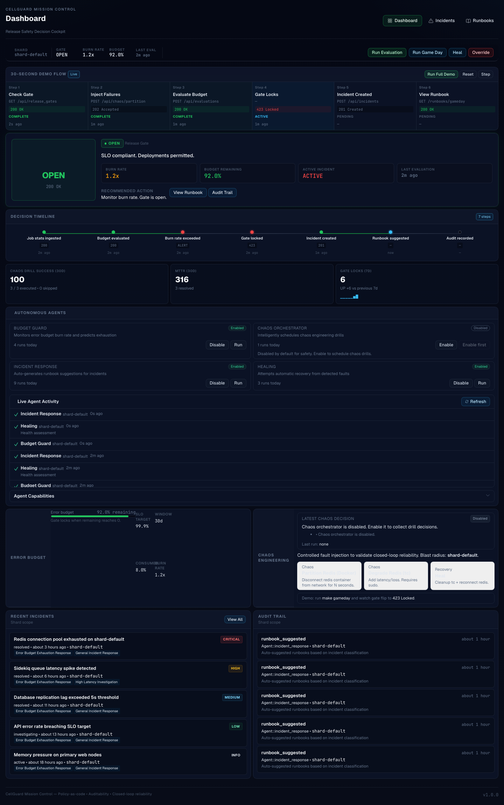
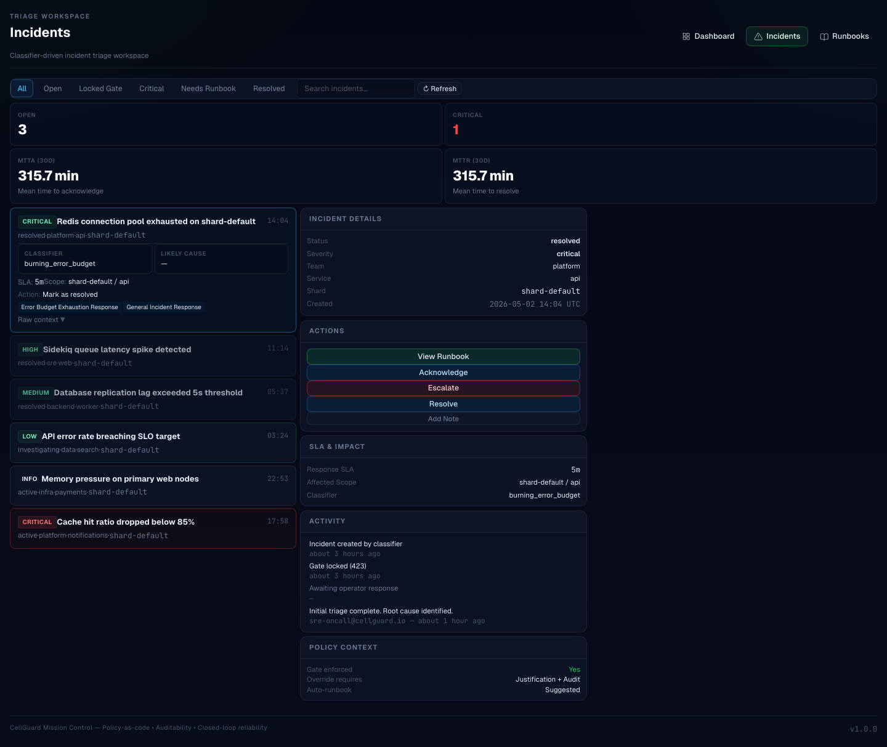
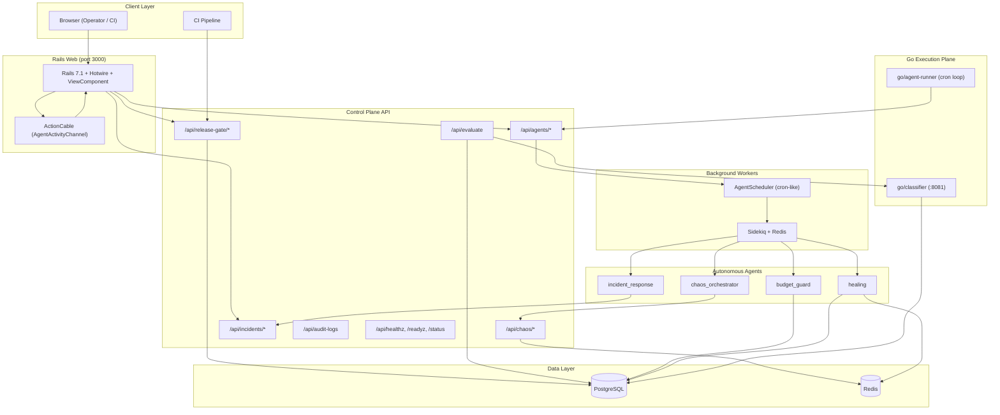

# CellGuard

> Reliability control plane that prevents bad deploys by enforcing release policy from live operational signals.

[](https://github.com/AngelP17/Cellguard/actions/workflows/gate-proof.yml)

CellGuard evaluates every release against live SLO data, blocks deploys with `HTTP 423 Locked` when reliability evidence says no, and runs autonomous agents for budget protection, chaos orchestration, incident response, and healing.


```mermaid
flowchart LR
    U["Operator or CI"] --> API["CellGuard API"]
    API --> BG["Release Gate"]
    API --> CH["Chaos Service"]
    API --> EV["Budget Evaluator"]
    CH --> RD["Redis / Infra Target"]
    EV --> DB["Postgres"]
    AG["Agent Scheduler"] --> SQ["Sidekiq"]
    SQ --> AGT["Agents"]
    AGT --> API
    UI["Dashboard + WebSocket Activity"] --> API
```

---

## Quick Demo (30 seconds)

```bash
ALLOW_DEMO_ENDPOINTS=true CLASSIFIER_STUB=true bin/run-all
```

Then in another terminal:

```bash
# 1. Gate starts open
curl -s http://localhost:3000/api/release-gate/check?shard=shard-default | jq

# 2. Inject failures
curl -s -X POST http://localhost:3000/api/inject-failures \
  -H "Content-Type: application/json" \
  -d '{"shard":"shard-default","queue":"default","minutes":5,"error_rate":0.15,"total":2000,"p95_latency_ms":650}' | jq

# 3. Evaluate
curl -s -X POST http://localhost:3000/api/evaluate \
  -H "Content-Type: application/json" \
  -d '{"shard":"shard-default","window_minutes":60}' | jq

# 4. Gate is now LOCKED
curl -si http://localhost:3000/api/release-gate/check?shard=shard-default | head -1
# → HTTP/1.1 423 Locked

# 5. Heal and re-check
curl -s -X POST http://localhost:3000/api/chaos/heal | jq
```

Open the dashboard at <http://localhost:3000/dashboard>.

---

## UI Entry Points

| Path | Purpose |
|------|---------|
| `/` | Landing page with live gate snapshot |
| `/dashboard` | Mission Control dashboard |
| `/incidents` | Incident triage workspace |
| `/runbooks/:slug` | Runbook viewer |

---

## Screenshots

### Dashboard — Mission Control


### Incidents — Triage Workspace


---

## Architecture


```mermaid
flowchart TB
    subgraph "Client Layer"
        UI["Browser (Operator / CI)"]
        CI["CI Pipeline"]
    end

    subgraph "Rails Web (port 3000)"
        WEB["Rails 7.1 + Hotwire + ViewComponent"]
        AC["ActionCable (AgentActivityChannel)"]
    end

    subgraph "Control Plane API"
        GATE["/api/release-gate/*"]
        EVAL["/api/evaluate"]
        CHAOS["/api/chaos/*"]
        AGENTS["/api/agents/*"]
        INC["/api/incidents/*"]
        AUDIT["/api/audit-logs"]
        HEALTH["/api/healthz, /readyz, /status"]
    end

    subgraph "Background Workers"
        SK["Sidekiq + Redis"]
        SCHED["AgentScheduler (cron-like)"]
    end

    subgraph "Autonomous Agents"
        BG["budget_guard"]
        CO["chaos_orchestrator"]
        IR["incident_response"]
        HE["healing"]
    end

    subgraph "Go Execution Plane"
        CLASS["go/classifier (:8081)"]
        RUNNER["go/agent-runner (cron loop)"]
    end

    subgraph "Data Layer"
        PG[("PostgreSQL")]
        RD[("Redis")]
    end

    UI --> WEB
    CI --> GATE
    WEB --> GATE
    WEB --> AGENTS
    WEB --> INC
    WEB --> AC
    GATE --> PG
    EVAL --> PG
    EVAL --> CLASS
    CHAOS --> RD
    AGENTS --> SCHED
    SCHED --> SK
    SK --> BG
    SK --> CO
    SK --> IR
    SK --> HE
    BG --> PG
    CO --> CHAOS
    IR --> INC
    HE --> PG
    HE --> RD
    CLASS --> PG
    RUNNER --> AGENTS
    AC --> WEB
```

---

## Local Development

### Prerequisites
- Ruby `3.3.0`
- Bundler `2.5.x`
- PostgreSQL `16`
- Redis (local or container)

### One-Command Start

```bash
ALLOW_DEMO_ENDPOINTS=true CLASSIFIER_STUB=true bin/run-all
```

This starts Rails web + Sidekiq worker + scheduler with the in-process Ruby classifier stub.

### Three-Terminal Mode

Terminal 1 (Web):
```bash
bin/dev
```

Terminal 2 (Workers):
```bash
bundle exec sidekiq -C config/sidekiq.yml
```

Terminal 3 (Go classifier on :8081):
```bash
make go-classifier-run
```

### Reset demo state

```bash
make reset-demo
make enable-chaos-orchestrator   # optional, default disabled for safety
```

---

## Production Docker Deployment

The app ships a production-ready Dockerfile. See [docs/DEPLOYMENT.md](./docs/DEPLOYMENT.md) for full instructions.

Minimal example:

```bash
docker build -t cellguard-web .
docker run -d --name cellguard-web -p 3000:3000 \
  -e DATABASE_URL=postgres://cellguard:secret@db:5432/cellguard_production \
  -e REDIS_URL=redis://redis:6379/0 \
  -e SECRET_KEY_BASE=$(openssl rand -hex 64) \
  -e CELLGUARD_TOKEN=$(openssl rand -hex 32) \
  -e CLASSIFIER_URL=http://classifier:8081 \
  cellguard-web
```

Required env vars: `DATABASE_URL`, `REDIS_URL`, `SECRET_KEY_BASE`, `CELLGUARD_TOKEN`, `CLASSIFIER_URL`.

Optional: `ALLOW_DEMO_ENDPOINTS` (dev/demo only), `GIT_SHA` (audit trail), agent toggles.

---

## Verification

### Tests

```bash
bundle exec rails test          # Rails test suite
make go-classifier-test         # Go classifier tests
make go-agent-runner-test       # Go agent-runner tests
```

### Game Day Proof

```bash
make gameday
```

This deterministic script proves the policy enforcement: gate starts open, faults are injected, evaluation runs, gate locks to 423, heal restores it.

### UI Evidence

```bash
make go-ui-smoke
```

Renders the dashboard and saves `tmp/ui-dashboard.png`.

### Health Checks

```bash
curl -s http://localhost:3000/api/healthz   # liveness
curl -s http://localhost:3000/api/readyz    # readiness (DB + Redis + Sidekiq + classifier)
curl -s http://localhost:3000/api/status    # detailed status with version
```

---

## API Reference

### Public (no token required)

| Endpoint | Purpose |
|----------|---------|
| `GET /api/healthz` | Liveness probe |
| `GET /api/readyz` | Readiness probe |
| `GET /api/status` | Detailed status with version |
| `GET /api/release-gate/check` | CI gate check (200 open / 423 locked) |
| `GET /api/agents/status` | Agent enablement and execution counts |
| `GET /api/agents/activity?limit=20` | Recent agent execution feed |

### Privileged (require `X-CELLGUARD-TOKEN` in production)

| Endpoint | Purpose |
|----------|---------|
| `POST /api/release-gate/override` | Audited manual override |
| `POST /api/evaluate` | Trigger budget evaluation + classification |
| `POST /api/ingest/job-stat` | Ingest operational metrics |
| `POST /api/inject-failures` | Demo: simulate failures (demo mode only) |
| `POST /api/chaos/partition` | Inject network partition (demo mode only) |
| `POST /api/chaos/heal` | Recover from chaos (demo mode only) |
| `GET /api/audit-logs` | Read audit trail |
| `POST /api/incidents/:id/acknowledge` | Acknowledge incident |
| `POST /api/incidents/:id/resolve` | Resolve incident |
| `POST /api/incidents/:id/escalate` | Escalate incident |
| `POST /api/incidents/:id/note` | Add note to incident |
| `POST /api/agents/run-all` | Run all enabled agents (async by default) |
| `POST /api/agents/:name/run` | Run a specific agent |
| `POST /api/agents/:name/toggle` | Enable/disable an agent |

---

## Security & Governance

- All gate overrides, chaos operations, agent toggles, and incident lifecycle mutations write to `audit_logs` with actor, method, path, IP, and timestamp.
- Privileged endpoints require `X-CELLGUARD-TOKEN` outside of development/demo.
- Chaos endpoints require `ALLOW_DEMO_ENDPOINTS=true` or development mode.
- Autonomous agents have safety guards (business hours, budget checks, incident awareness).
- No raw exception messages leak from API endpoints in production mode.
- See [AGENTS.md](./AGENTS.md) for the complete safety model and invariant contract.

---

## Documentation

- [AGENTS.md](./AGENTS.md) — Architecture, commands, safety model, done-when criteria
- [docs/AGENTS.md](./docs/AGENTS.md) — Agent runtime contract
- [docs/DEPLOYMENT.md](./docs/DEPLOYMENT.md) — Production Docker deployment
- [docs/runbooks/](./docs/runbooks/) — Operational runbooks (gameday, etc.)

---

## Troubleshooting

### `bundle exec rails test` fails with `ActiveRecord::NoEnvironmentInSchemaError`

Run migrations first:
```bash
bundle exec rails db:setup
```

### Gate stays open after `make gameday`

Check the classifier response:
```bash
curl -s -X POST http://localhost:3000/api/evaluate \
  -H "Content-Type: application/json" \
  -d '{"shard":"shard-default","window_minutes":60}'
```

If `is_violation` is `false`, the injected error rate was below the SLO threshold. Increase `error_rate` in the inject call.

### Sidekiq scheduler not running

Verify the scheduler is registered:
```bash
bundle exec sidekiq -C config/sidekiq.yml
```

Check `config/sidekiq.yml` for the `scheduler` block. The scheduler runs every 60s by default.

### Privileged endpoint returns 401

Set the token:
```bash
export CELLGUARD_TOKEN=your-secret-token
curl -X POST http://localhost:3000/api/release-gate/override \
  -H "X-CELLGUARD-TOKEN: $CELLGUARD_TOKEN" \
  -H "Content-Type: application/json" \
  -d '{"shard":"shard-default","actor":"you","justification":"reason"}'
```

---

## License

MIT
