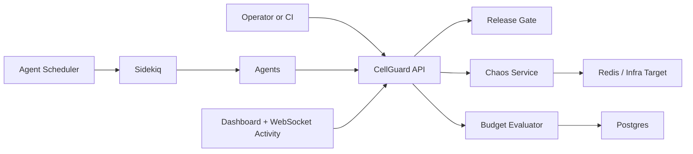
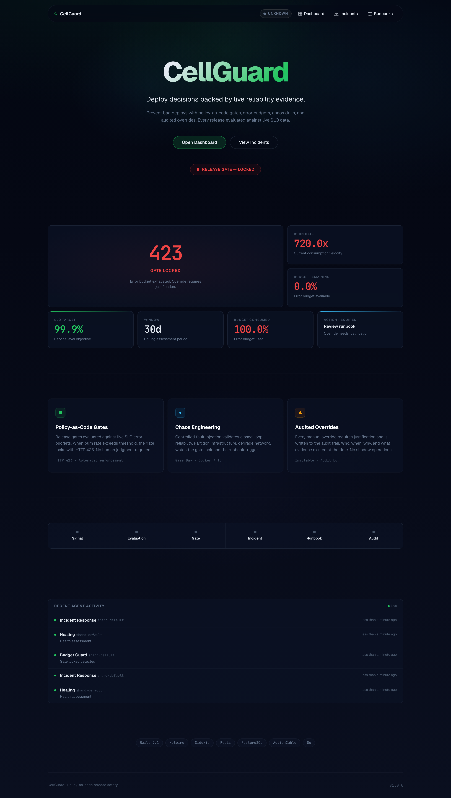
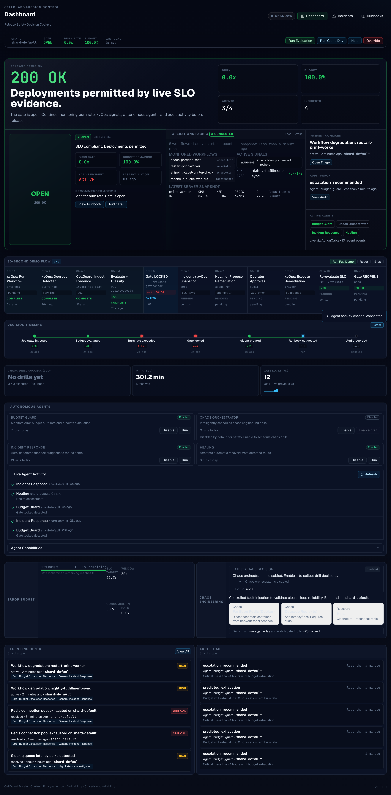
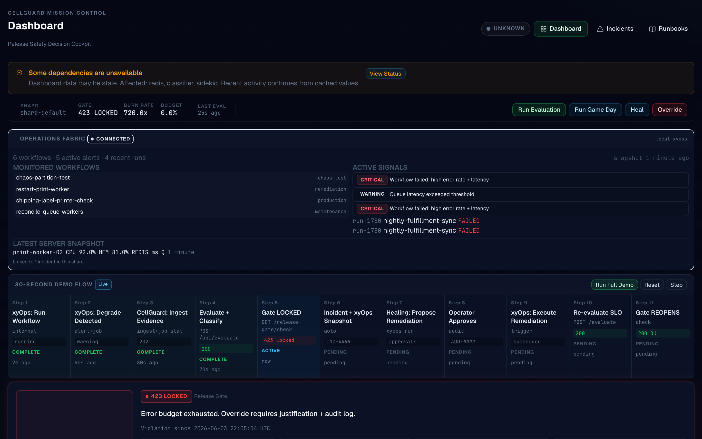
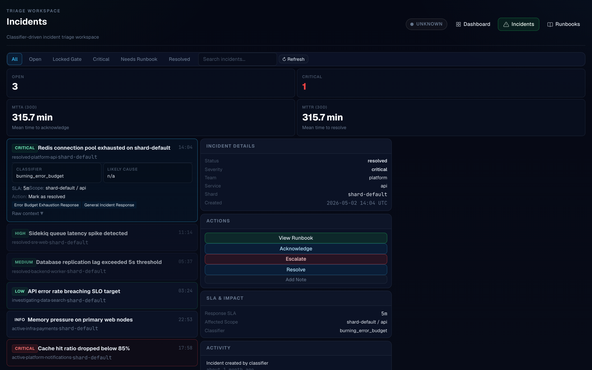
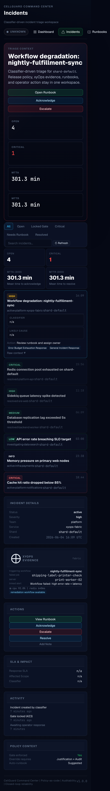
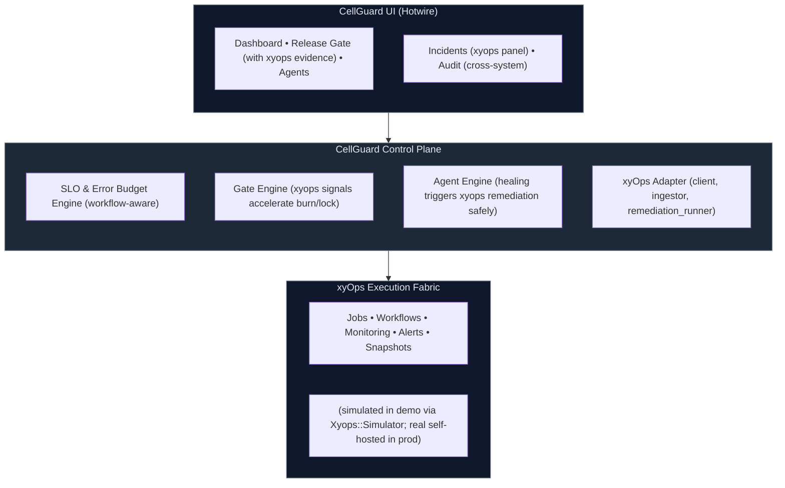
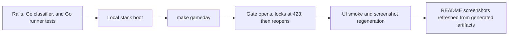

# CellGuard

> Self-hosted reliability control plane that governs operational workflows with SLO-aware release gates, autonomous reliability agents, chaos engineering, and audit-ready incident response.

[](https://github.com/AngelP17/Cellguard/actions/workflows/gate-proof.yml)

**CellGuard turns xyOps from an automation platform into a governed reliability system.**

In flagship mode, CellGuard runs on top of **xyOps** — your local execution fabric for jobs, workflows, monitoring, alerting, and automation. xyOps executes and observes. CellGuard decides what is safe, enforces policy, triggers remediation, and proves every action.

Together they form a complete, zero-cost, self-hosted reliability operating system.

CellGuard evaluates live SLO and workflow evidence, blocks risky deployments with `HTTP 423 Locked`, coordinates autonomous reliability agents (budget_guard, healing, incident_response, chaos_orchestrator), and records every privileged action in an immutable cross-system audit trail.


```mermaid
flowchart LR
    U["Operator or CI"] --> API["CellGuard API"]
    API --> BG["Release Gate"]
    API --> CH["Chaos Service"]
    API --> EV["Budget Evaluator"]
    CH --> RD["Redis / Infra Target"]
    EV --> DB["Postgres"]
    AG["Agent Scheduler"] --> SQ["Sidekiq"]
    SQ --> AGT["Agents"]
    AGT --> API
    UI["Dashboard + WebSocket Activity"] --> API
```

---

## Flagship Demo (Closed-Loop Governance)

```bash
ALLOW_DEMO_ENDPOINTS=true CLASSIFIER_STUB=true bin/run-all
```

Then:

```bash
# Full gameday (xyOps fabric degradation → CellGuard ingests context → 423 lock → healing triggers xyOps remediation → gate reopens + full audit)
make gameday
```

The dashboard and Operations Fabric panel show the complete working loop:


```mermaid
flowchart LR
    A["xyOps runs workflow"] --> B["Latency and error degradation"]
    B --> C["Alert, job context, and snapshot emitted"]
    C --> D["CellGuard ingests operational evidence"]
    D --> E["SLO evaluation with xyOps penalty"]
    E --> F["Release gate locks: HTTP 423"]
    F --> G["Incident created with evidence links"]
    G --> H["Healing agent requests remediation"]
    H --> I["xyOps remediation completes"]
    I --> J["CellGuard re-evaluates healthy signal"]
    J --> K["Release gate reopens: HTTP 200"]
    K --> L["Audit trail links decision, incident, and remediation"]
```

Open the dashboard at <http://localhost:3000/dashboard> to see the Operations Fabric, rich gate evidence, and cross-system proof.

---

## UI Entry Points

| Path | Purpose |
|------|---------|
| `/` | Landing page with live gate snapshot |
| `/dashboard` | Mission Control dashboard |
| `/incidents` | Incident triage workspace |
| `/runbooks/:slug` | Runbook viewer |

---

## Screenshots

Screenshots below showcase the flagship redesign: **mission-control cockpit** (first-viewport command composition with gate + xyOps fabric + agents + audit), **executive product proof** on landing (live OS command strip with gate/SLO/burn/budget/xyOps/agents/audit), and **incident command** triage (clear hierarchy, prominent xyOps evidence, usable mobile collapse). All evidence is real DB-backed; open/locked states are visually distinct.

### Landing — Executive Product Proof (first viewport)
Live reliability OS signals above the fold (gate state, burn, budget, xyOps fabric, active agents, recent audit):



### Dashboard — Mission Control Cockpit
Open gate (command composition: gate + fabric + agents peek + audit trail in first viewport):



Locked gate (red danger treatment + full xyOps "CAUSE OF LOCK" evidence block):



### Incidents — Triage / Incident Command
Featured incident + clear sections (details, xyOps evidence, actions, SLA, activity, policy); mobile stacks as usable workflow.



Mobile (375×812):

| Dashboard | Incidents |
|-----------|-----------|
|  |  |

---

**Regeneration:** After UI changes run `npm run screenshots`, `npm run screenshot:open`, `npm run screenshot:locked` (with server on 3000 + seeded state), plus `make go-ui-smoke`. Always inspect new PNGs with visual review before committing. See AGENTS.md for full frontend done-when + design conventions.

## Architecture (CellGuard governs xyOps)


```mermaid
flowchart TB
    subgraph UI["CellGuard UI (Hotwire)"]
        direction TB
        D["Dashboard • Release Gate (with xyops evidence) • Agents"]
        I["Incidents (xyops panel) • Audit (cross-system)"]
    end

    subgraph CP["CellGuard Control Plane"]
        direction TB
        SLO["SLO & Error Budget Engine (workflow-aware)"]
        GE["Gate Engine (xyops signals accelerate burn/lock)"]
        AE["Agent Engine (healing triggers xyops remediation safely)"]
        AD["xyOps Adapter (client, ingestor, remediation_runner)"]
    end

    subgraph XY["xyOps Execution Fabric"]
        WF["Jobs • Workflows • Monitoring • Alerts • Snapshots"]
        NOTE["(simulated in demo via Xyops::Simulator; real self-hosted in prod)"]
    end

    UI --> CP
    CP --> XY

    style UI fill:#0f172a,stroke:#64748b,color:#e2e8f0
    style CP fill:#1e2937,stroke:#64748b,color:#e2e8f0
    style XY fill:#0f172a,stroke:#64748b,color:#e2e8f0
```

**Division of responsibility**

| Layer                    | CellGuard owns                                      | xyOps owns                                      |
|--------------------------|-----------------------------------------------------|-------------------------------------------------|
| Reliability intelligence | SLOs, error budgets, release gates, lock decisions  | Operational context (jobs, workflows, alerts)   |
| Safety policy            | Gate rules, agent guardrails, full audit trail      | Workflow execution constraints                  |
| Incident response        | State, severity, runbooks, audit linkage            | Job history, server snapshots, alert context    |
| Automation               | budget_guard, healing, incident_response, chaos     | Cross-system workflows, scheduled automation    |
| Proof                    | "Why did the gate lock?"                            | "What was running, where, and what changed?"    |

**CellGuard governs xyOps.** xyOps runs the work. CellGuard makes the automations safe, SLO-aware, auditable, and release-impacting.

## Functional Proof

This README reflects a verified local system, not a static mockup. The proof path is:


```mermaid
flowchart LR
    T["Rails, Go classifier, and Go runner tests"] --> S["Local stack boot"]
    S --> G["make gameday"]
    G --> L["Gate opens, locks at 423, then reopens"]
    L --> U["UI smoke and screenshot regeneration"]
    U --> R["README screenshots refreshed from generated artifacts"]
```

---

## Local Development

### Prerequisites
- Ruby `3.3.0`
- Bundler `2.5.x`
- PostgreSQL `16`
- Redis (local or container)

### One-Command Start

```bash
ALLOW_DEMO_ENDPOINTS=true CLASSIFIER_STUB=true bin/run-all
```

This starts Rails web + Sidekiq worker + scheduler with the in-process Ruby classifier stub.

### Three-Terminal Mode

Terminal 1 (Web):
```bash
bin/dev
```

Terminal 2 (Workers):
```bash
bundle exec sidekiq -C config/sidekiq.yml
```

Terminal 3 (Go classifier on :8081):
```bash
make go-classifier-run
```

### Reset demo state

```bash
make reset-demo
make enable-chaos-orchestrator   # optional, default disabled for safety
```

---

## Production Docker Deployment

The app ships a production-ready Dockerfile. See [docs/DEPLOYMENT.md](./docs/DEPLOYMENT.md) for full instructions.

Minimal example:

```bash
docker build -t cellguard-web .
docker run -d --name cellguard-web -p 3000:3000 \
  -e DATABASE_URL=postgres://cellguard:secret@db:5432/cellguard_production \
  -e REDIS_URL=redis://redis:6379/0 \
  -e SECRET_KEY_BASE=$(openssl rand -hex 64) \
  -e CELLGUARD_TOKEN=$(openssl rand -hex 32) \
  -e CLASSIFIER_URL=http://classifier:8081 \
  cellguard-web
```

Required env vars: `DATABASE_URL`, `REDIS_URL`, `SECRET_KEY_BASE`, `CELLGUARD_TOKEN`, `CLASSIFIER_URL`.

Optional: `ALLOW_DEMO_ENDPOINTS` (dev/demo only), `GIT_SHA` (audit trail), agent toggles.

---

## Verification

### Tests

```bash
bundle exec rails test          # Rails test suite
make go-classifier-test         # Go classifier tests
make go-agent-runner-test       # Go agent-runner tests
```

### Game Day Proof

```bash
make gameday
```

This deterministic script proves the policy enforcement: gate starts open, faults are injected, evaluation runs, gate locks to 423, heal restores it.

### UI Evidence

```bash
make go-ui-smoke
```

Renders the dashboard and saves `tmp/ui-dashboard.png`.

### Health Checks

```bash
curl -s http://localhost:3000/api/healthz   # liveness
curl -s http://localhost:3000/api/readyz    # readiness (DB + Redis + Sidekiq + classifier)
curl -s http://localhost:3000/api/status    # detailed status with version
```

---

## API Reference

### Public (no token required)

| Endpoint | Purpose |
|----------|---------|
| `GET /api/healthz` | Liveness probe |
| `GET /api/readyz` | Readiness probe |
| `GET /api/status` | Detailed status with version |
| `GET /api/release-gate/check` | CI gate check (200 open / 423 locked) |
| `GET /api/agents/status` | Agent enablement and execution counts |
| `GET /api/agents/activity?limit=20` | Recent agent execution feed |

### Privileged (require `X-CELLGUARD-TOKEN` in production)

| Endpoint | Purpose |
|----------|---------|
| `POST /api/release-gate/override` | Audited manual override |
| `POST /api/evaluate` | Trigger budget evaluation + classification |
| `POST /api/ingest/job-stat` | Ingest operational metrics |
| `POST /api/inject-failures` | Demo: simulate failures (demo mode only) |
| `POST /api/chaos/partition` | Inject network partition (demo mode only) |
| `POST /api/chaos/heal` | Recover from chaos (demo mode only) |
| `GET /api/audit-logs` | Read audit trail |
| `POST /api/incidents/:id/acknowledge` | Acknowledge incident |
| `POST /api/incidents/:id/resolve` | Resolve incident |
| `POST /api/incidents/:id/escalate` | Escalate incident |
| `POST /api/incidents/:id/note` | Add note to incident |
| `POST /api/agents/run-all` | Run all enabled agents (async by default) |
| `POST /api/agents/:name/run` | Run a specific agent |
| `POST /api/agents/:name/toggle` | Enable/disable an agent |

---

## Security & Governance

- All gate overrides, chaos operations, agent toggles, and incident lifecycle mutations write to `audit_logs` with actor, method, path, IP, and timestamp.
- Privileged endpoints require `X-CELLGUARD-TOKEN` outside of development/demo.
- Chaos endpoints require `ALLOW_DEMO_ENDPOINTS=true` or development mode.
- Autonomous agents have safety guards (business hours, budget checks, incident awareness).
- No raw exception messages leak from API endpoints in production mode.
- See [AGENTS.md](./AGENTS.md) for the complete safety model and invariant contract.

---

## Documentation

- [AGENTS.md](./AGENTS.md) — Architecture, commands, safety model, done-when criteria
- [docs/AGENTS.md](./docs/AGENTS.md) — Agent runtime contract
- [docs/DEPLOYMENT.md](./docs/DEPLOYMENT.md) — Production Docker deployment
- [docs/runbooks/](./docs/runbooks/) — Operational runbooks (gameday, etc.)

---

## Troubleshooting

### `bundle exec rails test` fails with `ActiveRecord::NoEnvironmentInSchemaError`

Run migrations first:
```bash
bundle exec rails db:setup
```

### Gate stays open after `make gameday`

Check the classifier response:
```bash
curl -s -X POST http://localhost:3000/api/evaluate \
  -H "Content-Type: application/json" \
  -d '{"shard":"shard-default","window_minutes":60}'
```

If `is_violation` is `false`, the injected error rate was below the SLO threshold. Increase `error_rate` in the inject call.

### Sidekiq scheduler not running

Verify the scheduler is registered:
```bash
bundle exec sidekiq -C config/sidekiq.yml
```

Check `config/sidekiq.yml` for the `scheduler` block. The scheduler runs every 60s by default.

### Privileged endpoint returns 401

Set the token:
```bash
export CELLGUARD_TOKEN=your-secret-token
curl -X POST http://localhost:3000/api/release-gate/override \
  -H "X-CELLGUARD-TOKEN: $CELLGUARD_TOKEN" \
  -H "Content-Type: application/json" \
  -d '{"shard":"shard-default","actor":"you","justification":"reason"}'
```

---

## License

MIT
