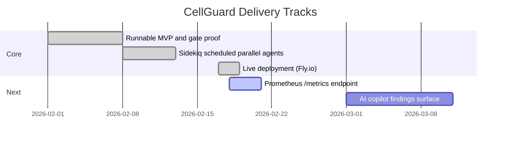

# CellGuard

> **Live Demo**: [https://cellguard-demo.fly.dev](https://cellguard-demo.fly.dev)  
> **Watch it work** (30 seconds): See the release gate flip from open → locked after chaos injection

[](https://cellguard-demo.fly.dev)
[](https://github.com/AngelP17/Cellguard/actions/workflows/gate-proof.yml)

CellGuard is a reliability control plane that enforces release policy from live operational signals.

## What it does

- **Policy-as-code release gate** (`200` open, `423 Locked` blocked)
- **Chaos workflows** for controlled failure injection and recovery
- **Audited override** path for governance
- **Autonomous agents** for budget protection, chaos orchestration, incident response, and healing


---

## 🚀 Try the Live Demo (No Install Required)

**URL**: [https://cellguard-demo.fly.dev](https://cellguard-demo.fly.dev)

The demo is a fully running instance with:
- Pre-configured shards and error budgets
- Autonomous agents running every 60 seconds
- Chaos endpoints enabled (safe, auto-healing)
- Real-time WebSocket activity feed

### Quick Demo Flow (30 seconds)

```bash
# 1. Check gate status (starts open)
curl https://cellguard-demo.fly.dev/api/release-gate/check?shard=shard-default

# 2. Inject failures (simulates degraded service)
curl -X POST https://cellguard-demo.fly.dev/api/inject-failures \
  -H "Content-Type: application/json" \
  -d '{"shard":"shard-default","error_rate":0.15,"total":1000}'

# 3. Evaluate budget (processes the failure signal)
curl -X POST https://cellguard-demo.fly.dev/api/evaluate \
  -H "Content-Type: application/json" \
  -d '{"shard":"shard-default","window_minutes":60}'

# 4. Gate is now LOCKED (HTTP 423)
curl -v https://cellguard-demo.fly.dev/api/release-gate/check?shard=shard-default
# → HTTP/2 423 (Locked)

# 5. View the dashboard
open https://cellguard-demo.fly.dev/dashboard
```

**What you'll see**:
- Green gate → Red locked gate in real-time
- Incident auto-created in the dashboard
- Audit trail showing the evaluation

---

## 📹 Video Demo (For Recruiters/Sharing)

Don't want to run commands? Watch this 60-second walkthrough:

[](https://youtu.be/YOUR_VIDEO_ID)

*(Replace with actual video link once recorded)*

**Or view the GIF**:


---

## 🏗️ Architecture Highlights


---

## 💻 Local Development (For Contributors)

### Prerequisites
- Ruby `3.3.0`
- Bundler `2.5.x`
- PostgreSQL `16`
- Redis (local or container)

### One-Command Start

```bash
ALLOW_DEMO_ENDPOINTS=true CLASSIFIER_STUB=true bin/run-all
```

This starts:
- Rails web server
- Sidekiq worker with scheduler
- Optional async agent fanout
- Live execution monitoring

### Manual 3-Terminal Mode

Terminal 1 (Web):
```bash
export PATH="/opt/homebrew/opt/postgresql@16/bin:$PATH"
eval "$(rbenv init - zsh)"
bin/dev
```

Terminal 2 (Workers):
```bash
export PATH="/opt/homebrew/opt/postgresql@16/bin:$PATH"
eval "$(rbenv init - zsh)"
bundle exec sidekiq -C config/sidekiq.yml
```

Terminal 3 (Trigger agents):
```bash
curl -X POST http://localhost:3000/api/agents/run-all \
  -H "Content-Type: application/json" \
  -d '{"async":true}'
```

---

## 🔌 Core APIs

| Endpoint | Purpose |
|----------|---------|
| `GET /api/release-gate/check` | Check if deploy is allowed |
| `POST /api/release-gate/override` | Audited manual override |
| `POST /api/ingest/job-stat` | Ingest operational metrics |
| `POST /api/evaluate` | Trigger budget evaluation |
| `POST /api/inject-failures` | Demo: simulate failures |
| `POST /api/chaos/partition` | Demo: network partition |
| `GET /api/agents/status` | View autonomous agent status |

---

## 🎮 Game Day Proof

```bash
make gameday
```

This deterministic script proves the policy enforcement:
1. Gate starts open (`200`)
2. Fault + evaluation pipeline runs
3. Gate locks (`423`)
4. Heal and re-check succeeds

---

## 🚢 Deployment

### Fly.io (Recommended)

```bash
# Setup (one time)
flyctl auth login
flyctl launch --name cellguard-demo

# Deploy
flyctl deploy

# Set secrets
flyctl secrets set ALLOW_DEMO_ENDPOINTS=true CLASSIFIER_STUB=true
```

### Auto-Deploy from GitHub

Pushes to `main` automatically deploy via `.github/workflows/deploy-fly.yml`.

Required GitHub secret:
- `FLY_API_TOKEN` - From `flyctl auth token`

---

## 📊 Roadmap



---

## 📚 Documentation

- [Agent Runtime Design](./docs/AGENTS.md)
- [Game Day Runbook](./docs/runbooks/gameday.md)
- [Architecture Overview](./docs/ARCHITECTURE.md)

---

## 🔐 Security & Governance

- All gate overrides are audited
- Chaos endpoints require `ALLOW_DEMO_ENDPOINTS=true`
- Autonomous agents have safety guards (business hours, budget checks)
- See [SECURITY.md](./SECURITY.md)

---

## 🎯 For Recruiters

**The 30-second pitch**:

> CellGuard is a reliability control plane that prevents bad deploys by monitoring error budgets in real-time. It features autonomous agents that predict issues before they happen, chaos engineering for resilience validation, and a 423 Locked gate that CI systems can query.
>
> **Try it**: https://cellguard-demo.fly.dev

**Key technical decisions**:
- Rails 7.1 + Hotwire for rapid UI development
- Sidekiq + Redis for reliable job processing
- Policy-as-code (423 status) for CI integration
- Autonomous agent layer for proactive reliability

---

Built with ☕ and 🛡️ for teams that care about reliability.
