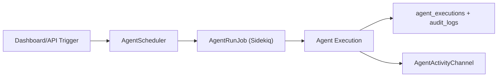

# CellGuard Autonomous Agents (Canonical Runtime Contract)

This document mirrors the authoritative runtime contract from `/Users/apinzon/Desktop/Active Projects/Cellguard/AGENTS.md`.

## Canonical source
- `/Users/apinzon/Desktop/Active Projects/Cellguard/AGENTS.md`

## Runtime summary
- Agents: `budget_guard`, `chaos_orchestrator`, `incident_response`, `healing`
- Hybrid execution:
  - Development: in-process/manual triggers
  - CI/production path: Sidekiq + Redis scheduler fanout
- Safety:
  - chaos actions only in development or with `ALLOW_DEMO_ENDPOINTS=true`
  - full execution audit trail in `agent_executions` and `audit_logs`

## Execution path

## API surface
- `GET /api/agents/status`
- `GET /api/agents/activity`
- `POST /api/agents/run-all`
- `POST /api/agents/:name/run`
- `POST /api/agents/:name/toggle`
