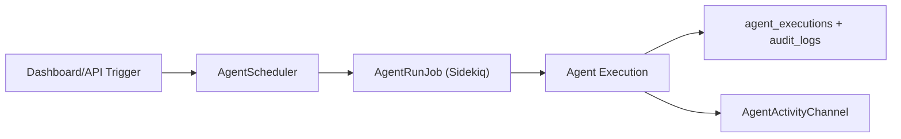

# CellGuard Autonomous Agents (Canonical Runtime Contract)

This document mirrors the authoritative runtime contract from [`/AGENTS.md`](../AGENTS.md) at the repository root.

## Canonical source
- `AGENTS.md` (repository root)

## Runtime summary
- Agents: `budget_guard`, `chaos_orchestrator`, `incident_response`, `healing`
- Hybrid execution:
  - Development: in-process/manual triggers
  - CI/production path: Sidekiq + Redis scheduler fanout
- Safety:
  - chaos actions only in development or with `ALLOW_DEMO_ENDPOINTS=true`
  - privileged mutations require `X-CELLGUARD-TOKEN` in production
  - full execution audit trail in `agent_executions` and `audit_logs`

## Execution path

```mermaid
flowchart LR
    A["Dashboard/API Trigger"] --> B["AgentScheduler"]
    B --> C["AgentRunJob (Sidekiq)"]
    C --> D["Agent Execution"]
    D --> E["agent_executions + audit_logs"]
    D --> F["AgentActivityChannel"]
```

## API surface
- `GET /api/agents/status`
- `GET /api/agents/activity`
- `POST /api/agents/run-all` (requires `X-CELLGUARD-TOKEN` in production)
- `POST /api/agents/:name/run` (requires `X-CELLGUARD-TOKEN` in production)
- `POST /api/agents/:name/toggle` (requires `X-CELLGUARD-TOKEN` in production)
