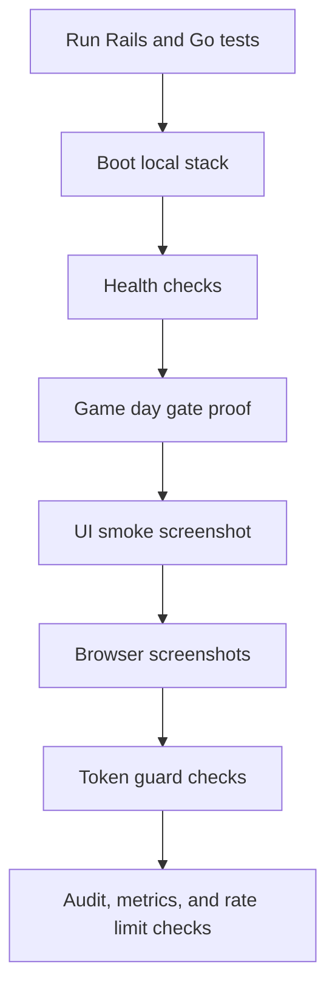

# Verification

This document lists the exact commands, expected output, and acceptance criteria for verifying a CellGuard deployment end-to-end. Run these in order. Each step is independent and can be re-run on a live system.



## Prerequisites

- Ruby `3.3.0`, Bundler `2.5.x`
- PostgreSQL `16` running and reachable
- Redis running and reachable on `REDIS_URL` (default `redis://localhost:6379/0`)
- Go `1.22+` for the classifier and agent-runner
- `jq` for pretty output (`brew install jq`)
- `make` for the gameday and smoke targets

## 1. Test suites

### Rails

On machines using rbenv (recommended for this repo):

```bash
rbenv exec bundle exec rails test
```

Or simply (if your shell has rbenv shims):

```bash
bundle exec rails test
```

**Expected:** `N runs, M assertions, 0 failures, 0 errors, 0 skips`

### Go classifier

```bash
make go-classifier-test
```

**Expected:** `ok cellguard/go/classifier/internal/decision`

### Go agent runner

```bash
make go-agent-runner-test
```

**Expected:** exit code `0` (no test files is acceptable; non-zero is not)

## 2. Boot the local stack

```bash
ALLOW_DEMO_ENDPOINTS=true CLASSIFIER_STUB=true bin/run-all
```

**Expected output (last lines):**
```
* Listening on http://0.0.0.0:3000
Use Ctrl-C to stop
```

**Acceptance:** Rails web, Sidekiq worker, and scheduler all running. `CLASSIFIER_STUB=true` removes the Go classifier dependency for local demo boot; Redis is still required for Sidekiq, ActionCable, and a fully ready stack.

## 3. Health checks

### Liveness

```bash
curl -fsS http://localhost:3000/api/healthz | jq
```

**Expected:**
```json
{
  "status": "ok",
  "time": "2026-..."
}
```

### Readiness

```bash
curl -fsS http://localhost:3000/api/readyz | jq
```

**Expected:** `"status": "ready"` when all dependencies are up. `"status": "degraded"` if Redis, Sidekiq, or classifier is unreachable. `checks.redis.status` should be `"ok"`.

### Detailed status

```bash
curl -fsS http://localhost:3000/api/status | jq
```

**Expected:** includes `version`, `git_sha`, `components.{database,redis,sidekiq,classifier}.status`.

## 4. Gate proof (game day)

```bash
make gameday
```

**Expected sequence:**
1. Baseline gate returns `200` (gate open)
2. Chaos partition returns `202 Accepted` (or success status)
3. Failure injection returns `{"status":"injected",...}`
4. Evaluate returns JSON with `classifier.is_violation: true`
5. Gate check now returns `HTTP/1.1 423 Locked`
6. Chaos heal returns `{"status":"heal_attempted",...}`

**Acceptance:** gate transitions from `200` to `423` and back within the script. The `make gameday` target exits `0`.

## 5. UI smoke

```bash
make go-ui-smoke
```

**Expected:** creates `tmp/ui-dashboard.png` (a screenshot of `/dashboard`). Exit code `0`.

**Note:** this target requires Chrome/Chromium and the Go toolchain. On headless servers use `--no-sandbox`.

## 6. Browser screenshots (desktop + mobile)

Manual verification of responsive layouts. Reference artifacts (latest run):

- `screenshots/landing-desktop.png` and `screenshots/landing-mobile.png` (executive product proof)
- `screenshots/dashboard-open.png` (gate open, SLO compliant)
- `screenshots/dashboard-locked.png` (gate locked, error budget exhausted)
- `screenshots/dashboard-mobile.png` (mobile open-gate command cockpit)
- `screenshots/incidents-desktop.png` and `screenshots/incidents-mobile.png`

To regenerate after UI changes:

```bash
npm run screenshots
npm run screenshot:open
npm run screenshot:locked
```

The npm scripts seed their target state where needed. `screenshot:open` owns open dashboard desktop and mobile, `screenshot:locked` owns locked dashboard, and `screenshots` owns landing and incidents. When testing a manually locked dashboard, run `make gameday` first and capture before recovery.

### Desktop (1440 x 900)

```bash
open http://localhost:3000/
open http://localhost:3000/dashboard
open http://localhost:3000/incidents
open http://localhost:3000/runbooks/gameday
```

**Acceptance:**
- Each page renders without layout overflow
- Gate panel shows clear `OPEN` / `LOCKED` state with color differentiation
- Recent Incidents and Audit Trail panels populated
- No empty-state messages
- No raw em-dashes in visible text (search for `-` in the rendered page)

### Mobile (375 x 812)

Use Chrome DevTools device emulation or a real device.

**Acceptance:**
- Navigation collapses to a single row (height <= 80px)
- Multi-column grids collapse to single column
- No horizontal scroll
- All interactive elements have `min-height: 44px` for touch
- Health badge remains visible

## 7. Token guard verification

In production mode (no `ALLOW_DEMO_ENDPOINTS`, `CELLGUARD_TOKEN` set), mutations must reject unauthenticated requests.

```bash
export CELLGUARD_TOKEN=$(openssl rand -hex 32)

# Without token: 401
curl -i -X POST http://localhost:3000/api/release-gate/override \
  -H "Content-Type: application/json" \
  -d '{"shard":"shard-default","actor":"test","justification":"x"}'
# Expected: HTTP/1.1 401 Unauthorized

# With valid token: 200
curl -i -X POST http://localhost:3000/api/release-gate/override \
  -H "X-CELLGUARD-TOKEN: $CELLGUARD_TOKEN" \
  -H "Content-Type: application/json" \
  -d '{"shard":"shard-default","actor":"test","justification":"x"}'
# Expected: HTTP/1.1 200 OK
```

**Repeat for:** `POST /api/agents/:name/toggle`, `POST /api/incidents/:id/acknowledge`, `GET /api/audit-logs`.

## 8. Audit trail verification

```bash
# Ingest a job-stat
curl -fsS -X POST http://localhost:3000/api/ingest/job-stat \
  -H "X-CELLGUARD-TOKEN: $CELLGUARD_TOKEN" \
  -H "Content-Type: application/json" \
  -d '{"shard":"shard-default","queue_namespace":"default","period_start":"2026-06-01T00:00:00Z","period_end":"2026-06-01T00:05:00Z","job_count":1000,"error_count":50,"latency_p95_ms":400}'

# Read audit logs
curl -fsS "http://localhost:3000/api/audit-logs?shard=shard-default" \
  -H "X-CELLGUARD-TOKEN: $CELLGUARD_TOKEN" | jq '.[0]'
```

**Expected:** most recent entry shows `actor`, `action`, `justification`, `metadata.path`, `metadata.at`.

## 9. Metrics endpoint

```bash
curl -fsS http://localhost:3000/api/metrics | jq '.counters, .gauges'
```

**Expected:** JSON object with `counters`, `gauges`, `timings` sections. After running agents, `classifier_requests_total` and `agent_executions_total` should be present.

## 10. Rate limiting

```bash
for i in $(seq 1 80); do
  curl -s -o /dev/null -w "%{http_code} " "http://localhost:3000/api/audit-logs?shard=shard-default&_n=$i" \
    -H "X-CELLGUARD-TOKEN: $CELLGUARD_TOKEN"
done
```

**Expected:** first 60 return `401` (no token) or `200` (with token), subsequent requests return `429` with body `{"error":"rate_limited",...}`.

## Done-when checklist

A change is ready to ship when:

- [ ] `bundle exec rails test` passes
- [ ] `make go-classifier-test` passes
- [ ] `make go-agent-runner-test` passes
- [ ] `make gameday` transitions gate from `200` to `423` and back
- [ ] `make go-ui-smoke` renders the dashboard without errors
- [ ] `curl /api/healthz` returns `200`
- [ ] `curl /api/readyz` returns `200` with all checks `ok`
- [ ] Unauthenticated mutations return `401` (not `200`)
- [ ] No raw em-dashes in any rendered view
- [ ] No "No incidents recorded" / "No audit events" / "N/A" in the dashboard
- [ ] Locked gate state is visually distinct from open gate state
- [ ] Mobile layouts (375px) have no horizontal scroll
- [ ] Health badge visible in nav on every page
- [ ] No raw exception messages in API error responses

## Troubleshooting

### `redis-cli: command not found`

`brew install redis && brew services start redis`

### `pg_isready: command not found`

`brew services start postgresql@16`

### Rails boot hangs on `Run options: --seed`

Check Sidekiq connection: `bundle exec sidekiq -C config/sidekiq.yml` in another terminal.

### Go classifier tests fail to build

`go version` must be `1.22+`. Upgrade with `brew install go`.

### `make gameday` returns `make: *** [gameday] Error 1`

Check the local stack is running and `jq` is installed. Re-run with `make gameday SHARD=shard-default` to target a specific shard.

### UI smoke produces a blank screenshot

The Rails server must be running and reachable on `http://localhost:3000`. Check that `ALLOW_DEMO_ENDPOINTS=true` is set if running the gameday in the same session.
