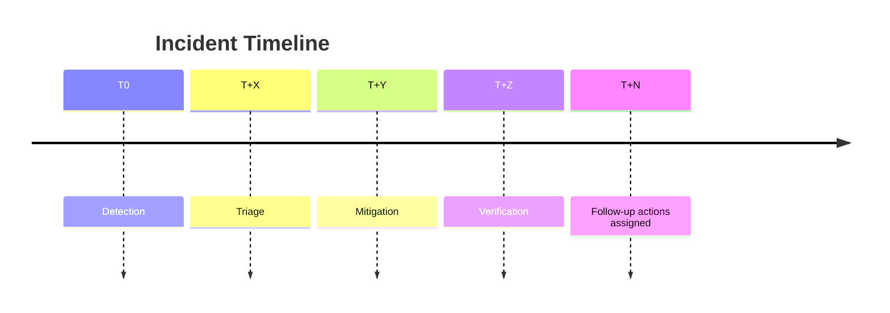

# Postmortem: <incident-title>

## Summary
What happened?

## Impact
Who/what was affected?

## Timeline
- T0:
- T+X:

## Root cause
What actually caused it?

## Detection
How did we detect it? (metrics, error budget, classifier)

## Resolution
What fixed it?

## Corrective actions
- [ ] Immediate
- [ ] Short term
- [ ] Long term

## Learnings
What should we do differently?
