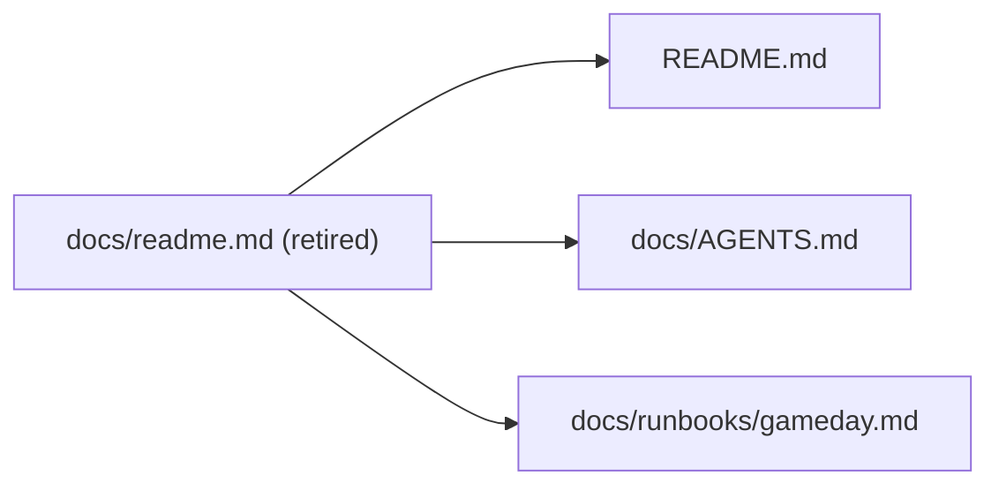

# Deprecated Document: `docs/readme.md`

This file is retired as a canonical source of truth.

Use these documents instead:
- Primary project README: `/Users/apinzon/Desktop/Active Projects/Cellguard/README.md`
- Agent runtime contract: `/Users/apinzon/Desktop/Active Projects/Cellguard/docs/AGENTS.md`
- Game Day runbook: `/Users/apinzon/Desktop/Active Projects/Cellguard/docs/runbooks/gameday.md`

## Why this was retired
The previous `docs/readme.md` was a large historical planning blueprint. Its relevant content has been consolidated into the canonical docs above to avoid conflicting instructions.

