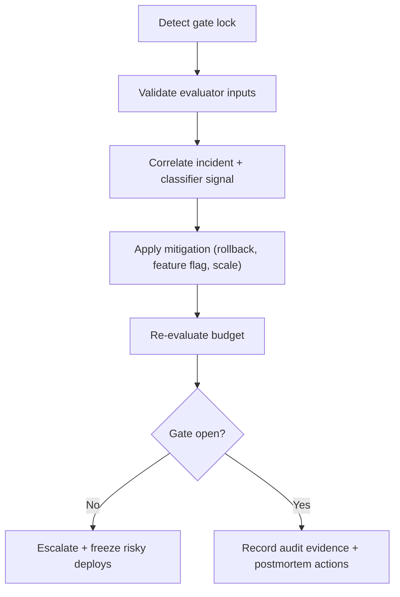

# Runbook: Error Budget Exhaustion Response

Use this runbook when release gate locks with `423` due to depleted SLO budget.

## Objective
- restore service reliability
- stop uncontrolled budget burn
- reopen release gate with auditable evidence

## Flow

## Steps
1. Confirm gate state:
   - `GET /api/release-gate/check?shard=shard-default`
2. Identify burn sources:
   - check recent `job_stats`
   - inspect recent deploys and queue backlogs
3. Apply mitigation:
   - rollback unstable deploy
   - disable faulting path with feature flag
   - scale workers if saturation-driven
4. Re-run evaluation:
   - `POST /api/evaluate`
5. If still locked:
   - keep deploy gate closed
   - escalate ownership and incident command

## Evidence to Capture
- gate status before/after mitigation
- incident id and classifier reason
- remediation action and timestamp
- audit log entry for override (if used)
