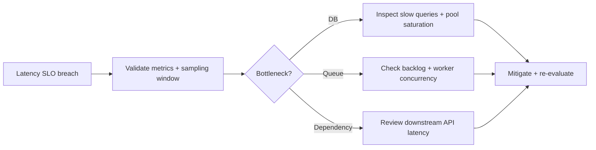

# Runbook: High Latency Investigation

Use this when classifier or telemetry indicates sustained high P95/P99 latency.

## Latency Triage Flow

## Steps
1. Confirm latency breach window and shard scope.
2. Check queue depth and worker throughput.
3. Validate database latency and connection pressure.
4. Inspect dependency health and timeout behavior.
5. Apply mitigation and re-check:
   - `POST /api/evaluate`
   - `GET /api/release-gate/check?shard=shard-default`

## Success Criteria
- latency returns below SLO threshold
- error budget burn returns to sustainable range
- no uncontrolled incident expansion
