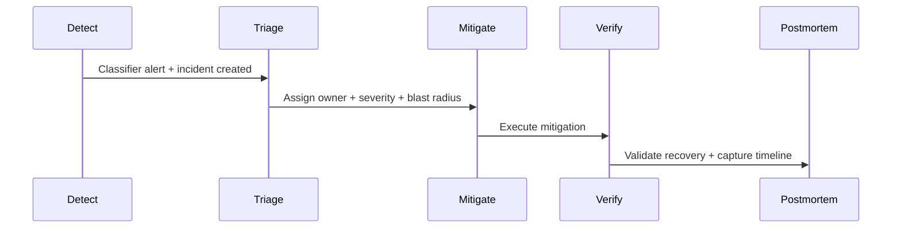

# Runbook: General Incident Response

Default response for active reliability incidents created by CellGuard.

## Flow

## Immediate Checklist
1. Assign incident commander and owning service.
2. Confirm severity and impact scope.
3. Validate `suggested_runbooks` from incident context.
4. Execute mitigation with smallest safe blast radius.
5. Verify burn-rate and gate state are stabilizing.
6. Document actions in audit trail.

## Exit Criteria
- no active customer impact
- release gate state is understood (open or intentionally locked)
- follow-up actions tracked with owners and due dates
