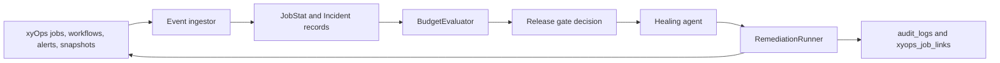

# xyOps Execution Fabric

CellGuard's flagship mode treats xyOps as the local operations execution fabric it governs.

## Governed execution loop

## Adapter

`app/services/xyops/`

- `client.rb` - unified interface (stub in demo, real remote later)
- `remediation_runner.rb` - the safety-critical path. Agents request workflows; demo auto-approves, prod requires token + UI approval; every call audited.
- `event_ingestor.rb` - turns xyops alerts/runs into CellGuard JobStat + Incident + XyopsJobLink records.
- `simulator.rb` - deterministic synthetic xyops data for the closed-loop demo.

## Data model

- `xyops_connections`
- `xyops_workflows`
- `xyops_workflow_runs`
- `xyops_alerts`
- `xyops_snapshots`
- `xyops_job_links` (the glue: links incidents, gate decisions (via error_budget), agent_executions to xyops artifacts for audit proof)

## How the gate became workflow-aware

`BudgetEvaluator` now reads recent failed `xyops_workflow_runs` + critical `xyops_alerts` and adds an operational penalty to `budget_consumed`. This makes real fabric pain accelerate lock decisions.

On transition to locked, it captures a snapshot and creates evidence links so the 423 response and incidents contain the full "what was running" story.

## UI surfaces

- Dashboard: Operations Fabric panel (workflows, alerts, runs, latest snapshot, linked incidents)
- Gate panel: when locked, "XYOPS EVIDENCE" block with workflow/job/server/alert/snapshot
- Incidents: dedicated xyOps Evidence panel on the featured incident
- Audit: new `xyops_remediation_triggered` actions + links appear in the trail

## Safety

All remediation goes through `Xyops::RemediationRunner`.
- Demo mode (ALLOW_DEMO_ENDPOINTS) auto-executes for the hero story.
- Production: requires token, explicit approval in UI, full `audit_logs` entry with justification and result.

## Demo story

See README "Flagship Demo" and `make gameday`.

The product truth is the closed loop: xyOps runs the automation, CellGuard decides if it is safe, blocks releases, triggers recovery, and proves the entire loop.
