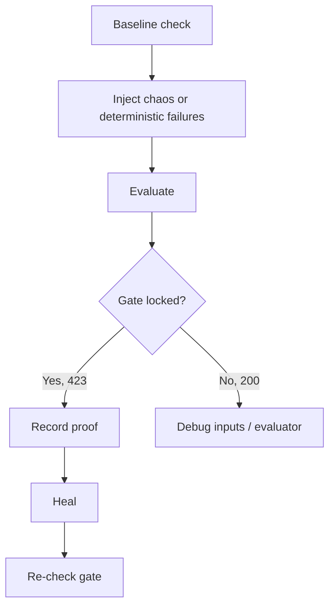

# Game Day Runbook: Gate Lock Proof + Chaos Recovery

This runbook validates the full control loop:
- inject fault signal
- evaluate reliability posture
- enforce release gate (`423 Locked`)
- heal and recover

## Flow



## Prerequisites
- Rails app bootable (`bin/dev` or `bin/run-all`)
- Postgres and Redis available
- For real Docker network partition mode:
  - `REDIS_CONTAINER` points to Redis container
  - `DOCKER_NETWORK` is reachable
- macOS note: TC mode (`tc` latency/loss) is Linux-only; use Docker mode on macOS

## Recommended execution

Single command:

```bash
make gameday
```

## Step-by-step API run
1. Baseline gate:

```bash
curl "http://localhost:3000/api/release-gate/check?shard=shard-default"
```

2. Inject chaos (Docker mode example):

```bash
curl -X POST http://localhost:3000/api/chaos/partition \
  -H "Content-Type: application/json" \
  -d '{"mode":"docker","duration_seconds":10}'
```

3. Inject deterministic failure stats:

```bash
curl -X POST http://localhost:3000/api/inject-failures \
  -H "Content-Type: application/json" \
  -d '{"shard":"shard-default"}'
```

4. Evaluate:

```bash
curl -X POST http://localhost:3000/api/evaluate \
  -H "Content-Type: application/json" \
  -d '{"shard":"shard-default"}'
```

5. Confirm gate lock (`423` expected):

```bash
curl -i "http://localhost:3000/api/release-gate/check?shard=shard-default"
```

6. Heal:

```bash
curl -X POST http://localhost:3000/api/chaos/heal \
  -H "Content-Type: application/json" \
  -d '{"shard":"shard-default"}'
```

## Parallel agent validation (optional)
Trigger async fanout and confirm new `agent_executions` rows:

```bash
curl -X POST http://localhost:3000/api/agents/run-all \
  -H "Content-Type: application/json" \
  -d '{"async":true}'
```

## Observability checkpoints
- `log/sidekiq.log` contains scheduler and worker activity
- `/api/agents/activity` returns recent runtime events
- `agent_executions` row count grows after run-all and scheduler ticks

## Success criteria
- Release gate returns `423 Locked` after evaluate step
- Chaos endpoints return structured responses (including `chaos_failed` on safe failure)
- Healing action succeeds and system returns to steady state
- Agent activity is recorded and queryable

## Troubleshooting
- Gate remains `200`: verify injected failure signal and evaluator inputs
- Chaos returns policy-simulation path: confirm `ALLOW_DEMO_ENDPOINTS=true`
- Docker chaos fails: verify `REDIS_CONTAINER` and `DOCKER_NETWORK`
- Scheduler silent: verify Sidekiq started with `config/sidekiq.yml`
